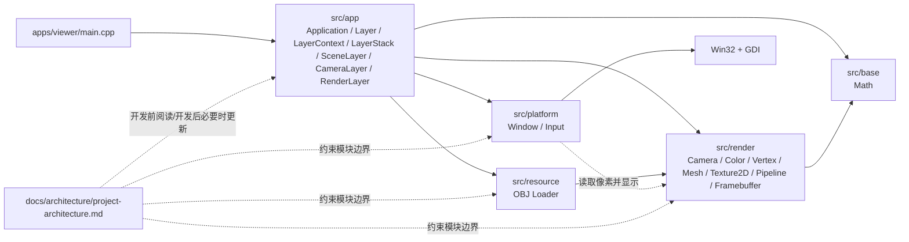
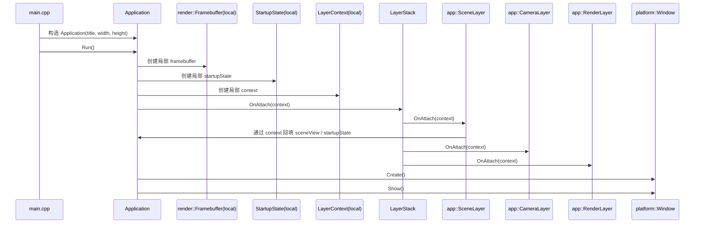

# 项目架构图与模块边界

## 1. 文档目的

这份文档描述当前 `softRanderer` 仓库已经落地的项目结构，而不是理想中的完整引擎形态。

它服务两个目标：

- 在开始新功能前，先建立“入口、调度、资源、平台、渲染、数学”的整体地图。
- 在功能开发影响模块职责、依赖方向或关键数据流时，作为必须同步维护的架构基线。

## 2. 本次已阅读的笔记文件

- `computer-graphics-notes/README.md`
- `computer-graphics-notes/lesson01-project-overview-and-entry.md`
- `computer-graphics-notes/lesson02-platform-window-and-input.md`
- `computer-graphics-notes/lesson03-math-and-camera.md`
- `computer-graphics-notes/lesson04-framebuffer-depth-and-msaa.md`
- `computer-graphics-notes/lesson05-vertex-uniform-varyings-and-programmable-shader-interface.md`
- `computer-graphics-notes/lesson06-software-rasterization-mainline.md`

## 3. 这些笔记对当前架构文档的约束与启发

- `lesson01` 约束我们先从 `main -> Application -> 主循环` 画起，架构图应优先反映总调度关系。
- `lesson02` 约束窗口、输入和消息泵应聚合为平台实现的一部分，而不是继续拆成过宽的应用门面。
- `lesson03` 启发我们把数学模块视为“基础支撑层”，它为变换和相机提供统一语言。
- `lesson04` 约束 `Framebuffer` 作为 CPU 渲染结果与窗口显示之间的桥接数据结构。
- `lesson05` 启发渲染模块内部要明确区分顶点输入、统一参数、插值数据和流水线执行器。
- `lesson06` 约束运行时主线要能表达“顶点 -> 三角形 -> 像素 -> 帧缓冲 -> 窗口”的数据流。

## 4. 当前项目架构总览



可以把当前仓库理解成 6 个运行时层次：

1. `apps/viewer`
   程序入口层，只负责构造应用并交出控制权。
2. `src/app`
   应用调度层，负责生命周期、主循环和 layer 编排。
3. `src/platform`
   平台实现层，负责窗口创建、消息泵、输入状态维护和最终显示。
4. `src/resource`
   资源接入层，负责把磁盘资源解析成运行时可消费的数据结构。
5. `src/render`
   软光栅核心层，负责 CPU 侧三角形处理与帧缓冲写入。
6. `src/base`
   基础数学层，负责向量、矩阵与变换工具。

## 5. 当前运行时主链路

### 5.1 启动链路



### 5.2 逐帧链路

```text
while (Window::ProcessEvents())
-> Application 从 Window 读取输入状态
-> Application 写 context.input
-> Application 驱动 LayerStack::OnUpdate(deltaTime, context)
-> CameraLayer 读取 context.input
-> CameraLayer 更新 render::Camera 的 Pos / Dir / Right
-> CameraLayer 写 context.activeCamera
-> Application 驱动 LayerStack::OnRender(context)
-> RenderLayer 读取 context.activeCamera / context.sceneView / context.framebuffer
-> RenderLayer 清颜色/清深度
-> Pipeline::Run(framebuffer, mesh)
-> 顶点着色
-> NDC/屏幕映射
-> 三角形光栅化
-> 深度测试与颜色写入
-> Window::Present(framebuffer)
-> StretchDIBits 显示到 Win32 窗口
```

### 5.3 关键数据流

```text
Win32 keyboard messages
-> Window::OnMessage()
-> Window 内部 InputState
-> Application 写 context.input
-> LayerStack::OnUpdate(deltaTime, context)
-> CameraLayer::OnUpdate(deltaTime, context)
-> render::Camera(Pos / Dir / Right / Up / Aspect)
-> context.activeCamera
-> LayerStack::OnRender(context)
-> RenderLayer 读取 Camera::ViewMat4() / ProjectionMat4()

OBJ(v + vt + vn) + mtllib/usemtl
-> resource::LoadLitMesh()
-> 解析 MTL(newmtl + map_Kd)
-> 解码 PNG/JPG/JPEG 为 Texture2D
-> SceneLayer 持有 OBJ 资源和 model matrix
-> context.sceneView
-> RenderLayer::OnRender(context)
-> Pipeline::Run()
-> vertexShader 输出 clipPos + worldPos + worldNormal + uv
-> 屏幕空间三角形遍历
-> fragmentShader 采样 Texture2D 并计算基础光照
-> Framebuffer(pixels + depth)
-> Window::Present()
-> Win32 GDI
```

## 6. 模块职责与边界条件

下面的“边界条件”重点回答四件事：

- 这个模块负责什么
- 它可以依赖谁
- 它向外暴露什么
- 它明确不该做什么

### 6.1 `apps/viewer`

**职责**

- 提供可执行程序入口。
- 构造 `sr::Application` 并调用 `Run()`。

**输入**

- 启动参数当前未接入，固定使用标题和窗口尺寸。

**输出**

- 进程级返回码。

**边界条件**

- 只做入口装配，不承载渲染、平台或数学逻辑。
- 不直接操作 `platform::Window`、`render::*`。
- 入口如果需要新增模式切换、命令行解析，也应以“配置应用”而不是“替代应用主循环”为原则。

### 6.2 `src/app`

**职责**

- 作为运行时总调度器管理生命周期。
- 持有 `LayerStack`，组织 `OnAttach / OnUpdate / OnRender / OnDetach` 的调用顺序。
- 在 `Run()` 内创建局部 `LayerContext / Framebuffer / StartupState`。
- 直接持有 `Window` 并维护主循环、present 与退出流程。
- 负责调度各 layer，但不拥有 scene/model/render 运行状态本体。

**输入**

- 应用标题、窗口宽高。
- `src/platform` 的窗口、输入和显示能力。
- `src/app` 内部 layer 提供的逐帧更新与渲染能力。
- `src/render` 的 `Framebuffer` 和相机数据。

**输出**

- 进程返回码。
- 对 `Window` 发出创建、事件处理与 present 请求。
- 对 `LayerStack` 发出逐帧更新与渲染分发请求。
- 向局部 `LayerContext` 提供输入、`Framebuffer` 和启动期共享状态。

**边界条件**

- 可以依赖 `platform`、`base`、`resource`、`render`，但不应下沉到 Win32 API。
- `Application` 负责“调度”，不直接持有具体 `SceneLayer`、`CameraLayer` 或 `RenderLayer`。
- 相机控制应放在 `CameraLayer::OnUpdate()`，场景装配应放在 `SceneLayer::OnAttach()`，渲染提交应放在 `RenderLayer::OnRender()`。
- 不应把 GDI、窗口句柄或资源所有权泄漏到应用接口。

### 6.3 `src/platform`

**职责**

- 提供窗口创建、消息泵、输入状态维护和最终显示的具体平台实现。
- 通过 `Window` 封装当前 Windows 平台细节。
- 把 `render::Framebuffer` 的像素数据显示到本地窗口。

**输入**

- 来自 `src/app` 的窗口参数。
- 来自 `src/render` 的 `Framebuffer` 只读像素数据。
- 来自操作系统的 Win32 消息、键盘事件和 GDI 显示能力。

**输出**

- `Window::Create / Show / ProcessEvents / Present / Input` 等实例级能力。

**边界条件**

- 平台层当前不再保留额外 `Platform` 门面，`Window` 直接作为应用层可见的窗口抽象。
- 可以维护并暴露输入状态、可以读取 `Framebuffer`，但不能反向修改渲染算法或场景数据。
- 不负责三角形光栅化、矩阵运算、mesh 组织或 shader 逻辑。
- 当前实现是 Windows-only；如果后续支持多平台，应在 `platform` 目录内扩展新的窗口实现，而不是把平台分支散到 `app` 层。

### 6.4 `src/render`

**职责**

- 持有 CPU 侧渲染核心数据结构与算法。
- 提供相机、颜色、顶点协议、mesh 容器、Texture2D、program、pipeline 与 framebuffer。
- 提供基础光照与最小 2D 纹理采样所需的顶点/统一参数/插值协议，并完成从顶点到像素的主要软光栅流程。

**输入**

- 顶点数据与索引数据。
- `uniforms` 和 shader 函数指针。
- `src/base` 提供的向量矩阵运算。

**输出**

- 写入 `Framebuffer` 的颜色与深度结果。

**边界条件**

- 可以依赖 `base`，不应依赖 `platform` 或 Win32。
- `Framebuffer` 是渲染结果容器，不负责窗口展示。
- `Pipeline` 负责主线执行，不负责应用生命周期和消息循环。
- `Camera / Vertex / Uniforms / Varyings / Texture2D / Program` 共同构成当前渲染层的重要共享协议；其中 `Camera` 负责纯数据和矩阵生成，新增 shader 能力时应尽量继续在这些协议内扩展，而不是把材质逻辑写进应用层。
- 当前实现以三角形列表和模板化 `Pipeline` 为核心；如果未来引入更多图元或阶段，也应尽量保持“渲染层负责渲染，不越界到平台显示”的原则。

### 6.5 `src/base`

**职责**

- 提供向量、矩阵、插值、裁剪辅助等基础数学能力。

**输入**

- 纯数学参数。

**输出**

- 无平台语义的数学结果。

**边界条件**

- 应保持无平台、无窗口、无业务场景依赖。
- 可以被 `app` 和 `render` 复用，但不应反向依赖上层模块。
- 新增基础数学工具时，应优先保持可复用、可验证，不混入渲染流程控制。

### 6.6 `src/resource`

**职责**

- 负责从磁盘读取最小 OBJ / MTL / base color 图片资源，并转换成渲染层可消费的 `render::Mesh<render::FlatColorVertex>`、`render::Mesh<render::LitVertex>` 与 `render::Texture2D`。
- 封装基础文件读取、OBJ 中 `mtllib / usemtl / v / vt / vn / f` 行解析、MTL 中 `newmtl / map_Kd` 解析和最小图片解码。

**输入**

- 来自 `src/app` 或 `SceneLayer` 的资源路径。
- 来自磁盘的 OBJ / MTL 文本内容和 PNG/JPG/JPEG 图片内容。

**输出**

- 面向应用层返回的加载结果，以及面向渲染层的数据结构 `render::Mesh<...>` 与 `render::Texture2D`。

**边界条件**

- 可以依赖 `render` 的顶点/mesh 协议，但不负责窗口显示、主循环或像素写入。
- 当前只接入最小 OBJ loader、最小 MTL(base color) 解析和 PNG/JPG/JPEG 外部纹理解码。
- 如果后续资源种类继续增多，应优先在 `resource` 目录内扩展，而不是把解析逻辑散落到 `app` 或 `render`。

### 6.7 `assets`

**职责**

- 存放模型、纹理、测试数据等静态资产。
- 当前已提供 `assets/models/cube.obj`、`assets/models/cube.mtl` 和 `assets/textures/cube-basecolor.png` 作为最小外部纹理加载链路的测试资源。

**边界条件**

- `assets` 本身只存数据，不承担解析逻辑。
- 资源格式解析仍应属于 `src/resource` 或未来的专门资源模块，不应放入平台层。

### 6.8 `docs`

**职责**

- 维护功能设计文档、架构文档与开发约束。

**边界条件**

- `docs/features/` 面向单次功能迭代。
- `docs/architecture/project-architecture.md` 面向项目级长期结构。
- 当代码改动影响模块职责、依赖方向、关键数据流、主要目录分层时，应优先更新架构文档，再交付功能。

## 7. 目录依赖规则

为避免后续结构失控，当前建议遵守以下依赖方向：

```text
apps/viewer -> src/app
src/app -> src/platform, src/resource, src/render, src/base
src/resource -> src/render
src/render -> src/base
src/platform -> src/render(仅 Framebuffer 显示接口), Win32/GDI
src/base -> 无上层依赖
```

不建议出现的依赖方向：

- `src/render -> src/platform`
- `src/resource -> src/platform`
- `src/base -> src/render` 或 `src/base -> src/app`
- `apps/viewer -> src/platform` 或 `apps/viewer -> src/render`
- 在 `src/app` 中直接写 Win32 API 调用

## 8. 当前架构的关键不变量

- 主控制流始终从 `main` 进入 `Application::Run()`。
- `Framebuffer` 是渲染结果的唯一主容器，窗口显示只消费它，不替代它。
- 平台显示和软光栅算法分层明确，平台层不实现渲染主线，渲染层不处理消息泵。
- 数学层保持纯工具属性，为应用装配和渲染执行同时服务。
- 当前渲染链以 `Camera + Program + Pipeline + Mesh + Texture2D + Framebuffer` 为基础协议。
- 当前 viewer 运行时只保留 OBJ 模型加载与渲染路径。

## 9. 什么时候必须更新这份架构图

出现以下任一情况时，功能开发完成后应同步更新本文件：

- 新增或删除一个项目级模块目录，例如新增 `src/scene`、`src/resource`。
- 改变现有模块职责，例如把窗口显示从 `platform` 移到别处。
- 改变主要调用方向，例如 `Application` 不再直接持有和调度 `Pipeline`。
- 改变关键共享数据结构，例如 `Framebuffer` 语义发生明显变化。
- 引入新的跨层协议，例如资源系统、场景系统、调试 UI 系统。
- 改变平台抽象方式，例如从单一 `Window` 扩展为多后端平台实现。

如果只是以下情况，通常不需要更新本文件：

- 单个函数重命名
- 模块内部私有实现重构
- 不影响职责边界的局部性能优化
- 不改变调用方向的文件拆分

## 10. 开发前阅读建议

每次开始新功能前，建议按下面顺序阅读：

1. 本文档，先定位会影响哪些模块、哪些依赖方向、哪些共享数据。
2. `AGENTS.md` 中映射到的相关 lesson。
3. 本次功能已有的 `docs/features/<feature-name>.md`，如果它已经存在。

如果发现“代码现状”和“本文档”不一致，应优先指出差异，并在实现或 review 迭代中补齐更新。
